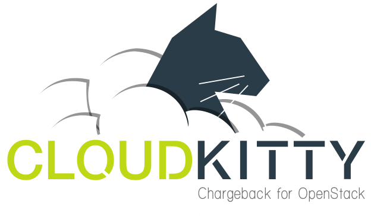

========================
Team and repository tags
========================

.. image:: https://governance.openstack.org/tc/badges/cloudkitty.svg
    :target: https://governance.openstack.org/tc/reference/tags/index.html

.. Change things from this point on

==========
CloudKitty
==========

Rating as a Service component
+++++++++++++++++++++++++++++

Goal
----

CloudKitty aims at filling the gap between metrics collection systems like
ceilometer and a billing system.

Every metrics are collected, aggregated and processed through different rating
modules. You can then query CloudKitty's storage to retrieve processed data and
easily generate reports.

Most parts of CloudKitty are modular so you can easily extend the base code to
address your particular use case.

You can find more information on its architecture in the documentation,
`architecture section`_.

Status
------

CloudKitty has been successfully deployed in production on different OpenStack
systems.

You can find the latest documentation on documentation_.

Contributing
------------

We are welcoming new contributors, if you've got new ideas, suggestions or want
to contribute contact us.

You can reach us thought IRC (#cloudkitty @ oftc.net), or on the official
OpenStack mailing list openstack-discuss@lists.openstack.org.

A storyboard_ is available if you need to report bugs.

Additional components
---------------------

We're providing an OpenStack dashboard (Horizon) integration, you can find the
files in the cloudkitty-dashboard_ repository.

A CLI is available too in the python-cloudkittyclient_ repository.

Trying it
---------

CloudKitty can be deployed with DevStack, more information can be found in the
`devstack section`_ of the documentation.

Deploying it in production
--------------------------

CloudKitty can be deployed in production on OpenStack environments, for
more information check the `installation section`_ of the documentation.

Getting release notes
---------------------

Release notes can be found in the `release notes section`_ of the
documentation.

Contributing to CloudKitty
--------------------------

For information on how to contribute to CloudKitty, please see the contents of
the CONTRIBUTING.rst.

Any new code must follow the development guidelines detailed in the HACKING.rst
file, and pass all unit tests.

.. Global references and images

.. _documentation: https://docs.openstack.org/cloudkitty/latest/

.. _storyboard: https://storyboard.openstack.org/#!/project/890

.. _python-cloudkittyclient: https://opendev.org/openstack/python-cloudkittyclient

.. _cloudkitty-dashboard: https://opendev.org/openstack/cloudkitty-dashboard

.. _architecture section: https://docs.openstack.org/cloudkitty/latest/admin/architecture.html

.. _devstack section: https://docs.openstack.org/cloudkitty/latest/admin/devstack.html

.. _installation section: https://docs.openstack.org/cloudkitty/latest/admin/install/index.html

.. _release notes section: https://docs.openstack.org/releasenotes/cloudkitty/

.. _contributing: https://docs.openstack.org/cloudkitty/latest/contributor/contributing.html
