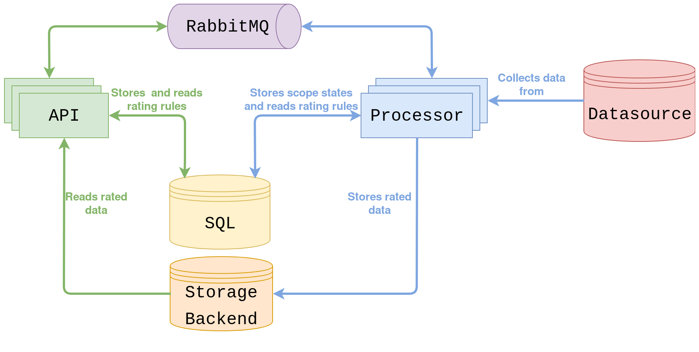
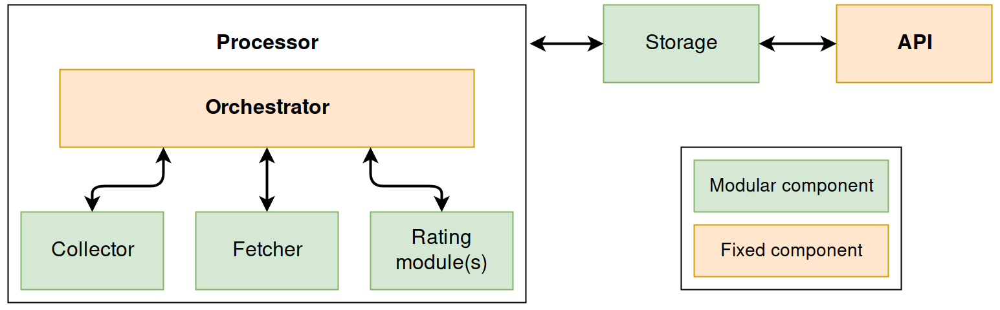

=========================
CloudKitty's Architecture
=========================

CloudKitty can be cut into four big parts:

* Data retrieval (API)
* Data collection (``cloudkitty-processor``)
* Data rating
* Data storage

These parts are handled by two processes: ``cloudkitty-api`` and
``cloudkitty-processor``. The data retrieval part is handled by the
``cloudkitty-api`` process, the other ones are handled by
``cloudkitty-processor``.

The following is an overview of CloudKitty's architecture:

For details about the API, see the `api reference`_

The processor falls into the following parts:

* The **fetcher** retrieves a list of **scopes** to rate. A scope
  distinguishes and isolates data. It also allows to split the workload
  between several cloudkitty-processor workers. It can be anything
  that makes sense in a given context, like an OpenStack project or a
  Kubernetes namespace.

* The **collector** collects data from a source for a given scope and
  metric.

* The collected data is then passed to the **rating modules** (several modules
  can be enabled at the same time). These will apply user-defined rating rules
  to the collected data.

* Once the data has been rated, it is passed to the **storage driver**, which
  will store it in a given storage backend. This data will then be available
  through the API.

.. _api reference: ../api-reference/index.html

Module loading and extensions
=============================

Nearly every part of CloudKitty makes use of stevedore_ to load extensions
dynamically. The following schema shows the modular parts:

Every rating module is loaded at runtime and can be enabled/disabled directly
via CloudKitty's API. The module is responsible of its own API to ease the
management of its configuration.

Collectors, fetchers and the storage backend are loaded at runtime but must be
configured in CloudKitty's configuration file.

.. _stevedore: https://docs.openstack.org/stevedore/latest/

Fetcher
=======

Five fetchers are available in CloudKitty:

* The ``keystone`` fetcher retrieves a list of projects on which the
  cloudkitty user has the ``rating`` role from Keystone.

* The ``gnocchi`` fetcher retrieves a list of attributes from `Gnocchi`_ for a
  given resource type. This is used for standalone Gnocchi deployments or to
  discover new projects from Gnocchi when it is used with OpenStack. It can be
  used in an OpenStack context or with a standalone Gnocchi deployment.

* The ``prometheus`` fetcher works in a similar way to the Gnocchi fetcher,
  which allows to discover scopes from `Prometheus`_.

* The ``source`` fetcher is the simplest one: it reads a list of scopes from
  the configuation file and provides it to the collector.

Details about the configuration of each fetcher are available in the
`fetcher configuration guide`_ .

.. _fetcher configuration guide: configuration/fetcher.html

Collector
=========

There are three collectors available in CloudKitty:

* The ``gnocchi`` collector retrieves data from `Gnocchi`_. It can be used in
  an OpenStack context or with a standalone Gnocchi deployment.

* The ``prometheus`` collector retrieves data from `Prometheus`_.

Details about the configuration of each collector are available in the
`collector configuration guide`_.

For information about how to write a custom collector, see
the `developer documentation`_.

.. _developer documentation: ../developer/collector.html
.. _collector configuration guide: configuration/collector.html
.. _Gnocchi: https://gnocchi.xyz/
.. _Prometheus: https://prometheus.io/docs/introduction/overview/

Rating
======

Two rating modules are available in cloudkitty (``noop`` is not considered a
real module, as it does nothing). Several rating modules can be enabled at the
same time. Data will be passed to the enabled modules consecutively. The
module priority can be set through the API, and it determines the order in
which they will process the data (modules with the highest priority first).

* The ``hashmap`` rating module is the most used one. It allows to create
  rating rules based on metric metadatas.

* The ``pyscripts`` rating module allows to rate data with custom python
  scripts.

For information about the usage and configuration of rating modules, see the
`rating modules documentation`_.

.. _rating modules documentation: ../user/rating/index.html

Storage
=======

The storage module is responsible for storing and retrieving data from a
backend. It implements two interfaces (v1 and v2), each providing one or more
drivers. For more information about the storage backend, see the
`configuration section`_.

.. _configuration section: configuration/storage.html
